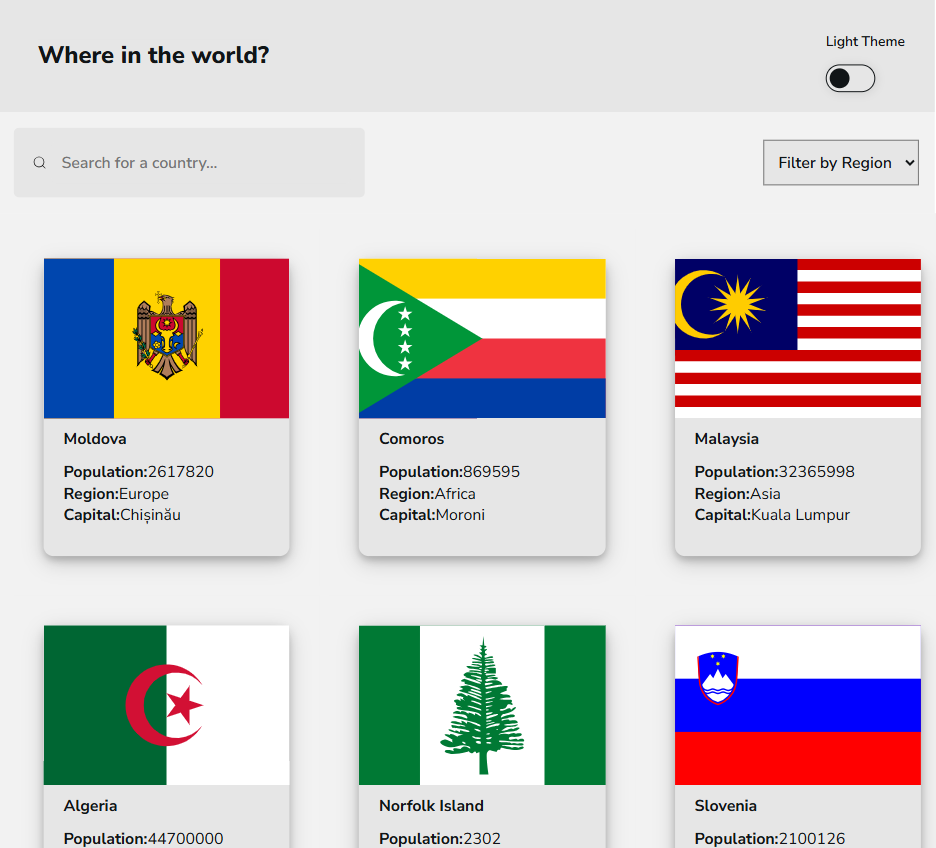
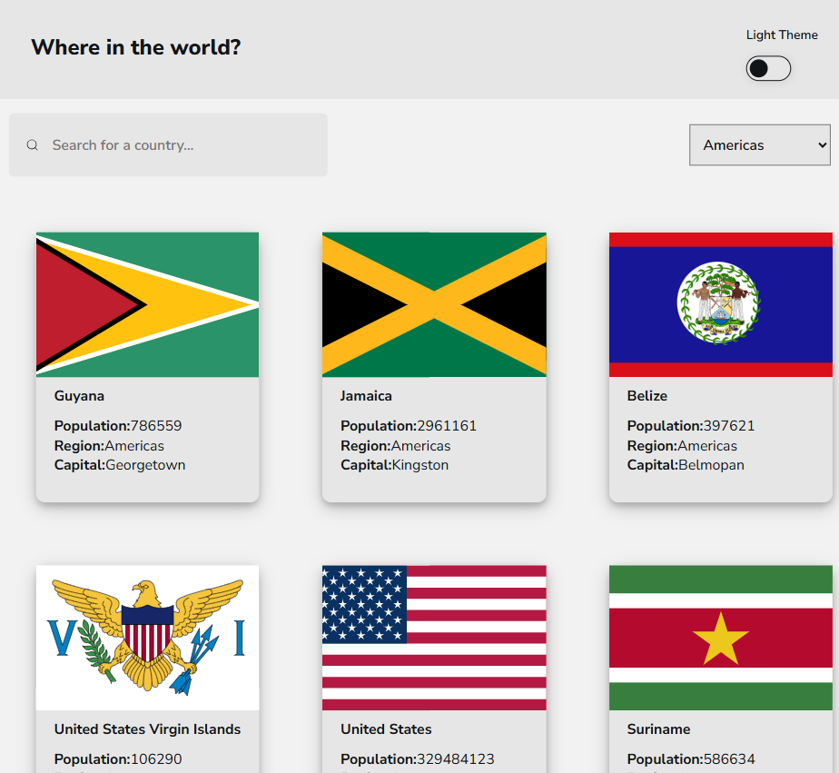
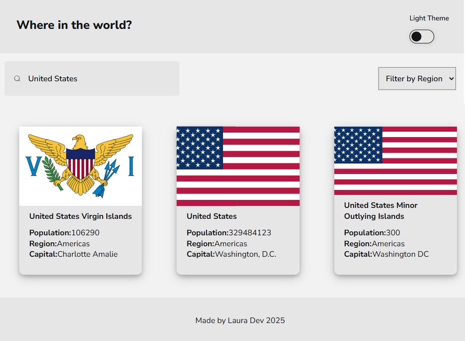
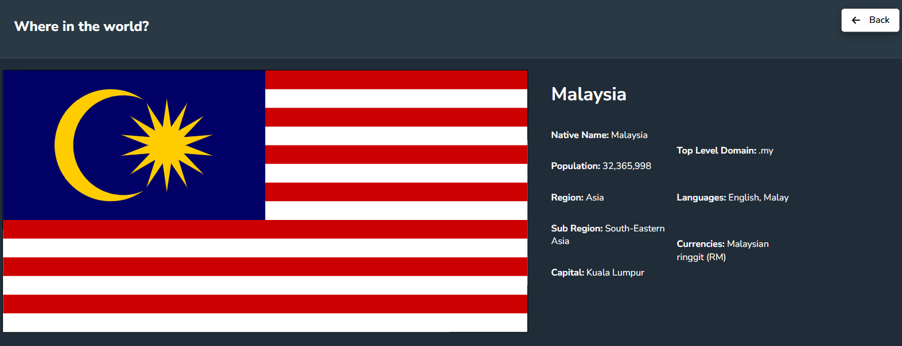
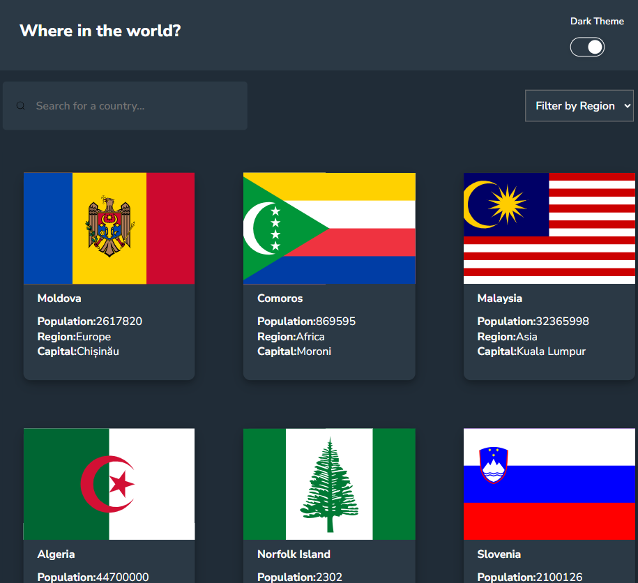

# REST Countries API with color theme switcher solution

The design challenge was to integrate with the REST Countries API to pull country data and display it based on the design portfolio given. 

Users should be able to:
- See all countries from the API on the homepage
- Search for a country using an `input` field
- Filter countries by region
- Click on a country to see more detailed information on a separate page
- Toggle the color scheme between light and dark mode

## Table of contents

- [Overview](#overview)
  - [Screenshots](#screenshots)
  - [Links](#links)
- [My process](#my-process)
  - [Built with](#built-with)
  - [What I learned](#what-i-learned)
  - [Useful resources](#useful-resources)
- [Author](#author)
- [Acknowledgments](#acknowledgments)

## Overview

This project was inspired by the "REST Countries API with color theme" challenge from Frontend Mentor. I was provided with a design portfolio and tasked with building the website based solely on the visual requirements, without any additional instructions.

This is a solution to the [REST Countries API with color theme switcher challenge on Frontend Mentor](https://www.frontendmentor.io/challenges/rest-countries-api-with-color-theme-switcher-5cacc469fec04111f7b848ca). Frontend Mentor challenges help you improve your coding skills by building realistic projects. 

There are no assets for this challenge, as the country flags will be pulled from the [REST Countries API](https://restcountries.com) and I used React Icon library.

### Screenshots

Country Homepage:

Country Homepage Filtered Region:

Country Homepage Filtered Country:

Country Page Detail:

Dark Theme:

### Links

- Solution URL: [Add solution URL here](https://your-solution-url.com)
- Live Site URL: [Add live site URL here](https://your-live-site-url.com)

## My process

The REST Countries API project was developed to provide accessible and structured information about countries worldwide through a clean and scalable RESTful interface. The development process began with initializing the project structure and importing a comprehensive dataset of country information. 

Using the API, I was able to represent key country attributes such as ISO codes, names, capitals, regions, and currencies. API endpoints were progressively implemented to support searching, filtering, and retrieving detailed country data. 

Additional features like dark theme, single page display of information, mobile responsiveness were added. Error debugging and design were completed continously throughout the building of the project.

### Built with

- Semantic HTML5 markup
- CSS custom properties
- Flexbox
- CSS Grid
- Mobile-first workflow
- [React](https://reactjs.org/) - JS library
- React Icons

### What I learned

1. Displaying API Data in Cards - I learned how to work better with API data and display on the frontend. I used useSTate for data, loading state and error handling and useEffect to fetch the data when the component mounts. I created a card component that is reusable to accept data as props. I mapped over the data and rendered the cards. I integrated the data into my app.
2. Syntax Erros - Missing intializer in const declaration. I received this error working on my Axios backend to frontend connection. Through this I realized my reusable card component needed to be a function, and not a const. In React, declaring a functional component vs. assigning an arrow function to a const variable revolves around preferences. The biggest difference is hoisting - when using a function component, it hoists it to the top of the file.
3. TypeError - data.map is not a function of App. This error involved declaring my data variable and useState. I realized that data should be an array and not an empty string when declaring. The map () method i s a standard JS array method use to iterate over array elements.
4. Fetching Data with Axios - Wrap Axios call within in async function and use await axios.get() to pause execution until the promise returns. Use a try...catch block for robust error handling.
5. Add index as a second parameter in .map() - Map method needs two arguments - the current item listed first and the second is the index starting at 0.
6. Correctly Passing Data to Props - I was intially referencing properties that didn't exist or were structured differently. I was able to change the values based on actual structure and successfully pass the information. I learned to always check my actual data structure.
7. Mapping CSS with Grid Container - I learned that I was mapping each item in one grid container item instead of each individual item across the row. The below was the incorrect code:

``{/* Country Card component */}
        

          {loading ? (
            
Loading...

          ) : error ? (
            
Error: {error}

          ) : (
            

              

                {data.map((item, index) => (
                  <CountryCard
                    key={index}
                    country={item.name.common}
                    imageUrl={item.flag}
                    population={item.population}
                    region={item.region}
                    capital={item.capital?.[0] || "N/A"} />
                ))}
                

            

          )}
        

      
``

I was able to update the code to have the div tag on the inside of the map method.

``{/* Country Card component */}
        

          {loading ? (
            
Loading...

          ) : error ? (
            
Error: {error}

          ) : (
            

                {data.map((item, index) => (
                  

                  <CountryCard
                    country={item.name.common}
                    imageUrl={item.flag}
                    population={item.population}
                    region={item.region}
                    capital={item.capital?.[0] || "N/A"} />
                  

                ))}
            

          )}``

8. CSS Styling of the Country Card - I was trying to style the country card component to match the design requirements. I found that after some altering of the padding, adding the image with object cover and stretching the image for responsive design allowed for optimal use.
9. Filtering of Countries - Filtering of countries was somewhat challenging because I had never worked on a filter through an API before. I realized that when I fetched the data, I was able to also update a state variable with country information. I wrapped the nav bar with the dropdown options in a handleFilterChange function. When someone selected the filter, it would create an event target value and update accordingly.
10. Difference between Justify-content and align-items: Justify-content controls the alignment and distribution of items on the main axis of the flex. Align-items controls the alignment of items along the cross axis of the flex or grid container.
11. Fixing props passing of additional information - I was trying to figure out to pass more information to the individual country pages. I found that doing a console.log determined what information was being passed. From there, I updated the fetch request to include the additional information which ultimately was able to pass the information to the countires.
12. Using correct index to display filtered list - I was using the index from the original allCountries array for everything when I should have specified the list. When a user selected a country from the filtered list(data), it navigated to using a index that no longer matches allCountries leading to the wrong data being shown. To fix this, I used the country object from data array, not allCountires[index].

### Useful resources

- [Vite Start Guide](https://vite.dev/guide/) - This is helped me install Vite with ReactJS for my project.
- [Google Fonts](https://www.w3schools.com/css/css_font_google.asp) - This helped me integrate Google Fonts into CSS language for matching the design portfolio requirements.
- [REST Countries API](https://restcountries.com/) - This is the API used for the project.
- [React Icons](https://react-icons.github.io/react-icons/search/#q=) - This provided the icons for the website.
- [CSS Box Shadow](https://www.w3schools.com/css/css3_shadows_box.asp) Box shadow property to create paper like cards.
- [Const vs Function Component](https://dev.to/ugglr/react-functional-components-const-vs-function-2kj9) - Explanation of const vs function component.
- [R](h) - This provided the icons for the website.
- [R](h) - This provided the icons for the website.

## Author

- Website - [Laura V](www.lauradeveloper.com)
- Frontend Mentor - [@lavollmer](https://www.frontendmentor.io/profile/lavollmer)
- Github - [@lavollmer](https://github.com/lavollmer)

